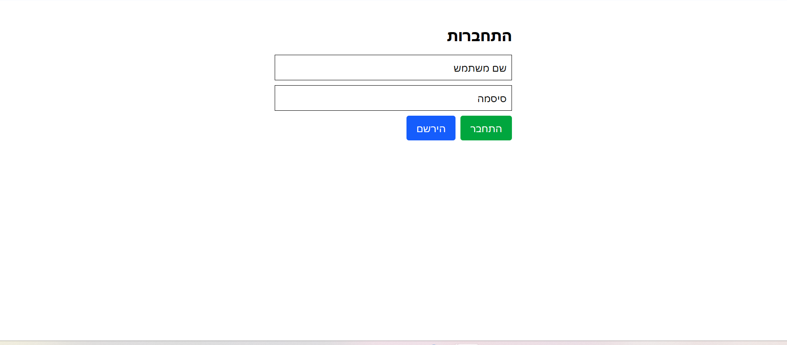
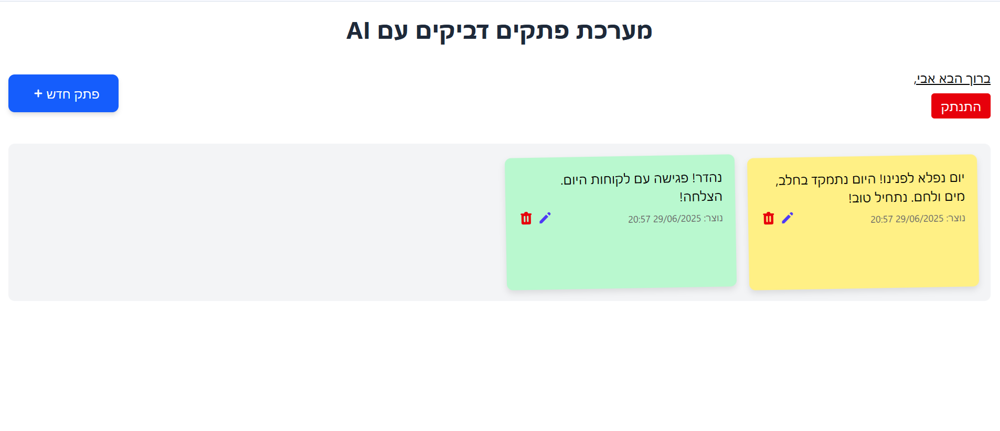
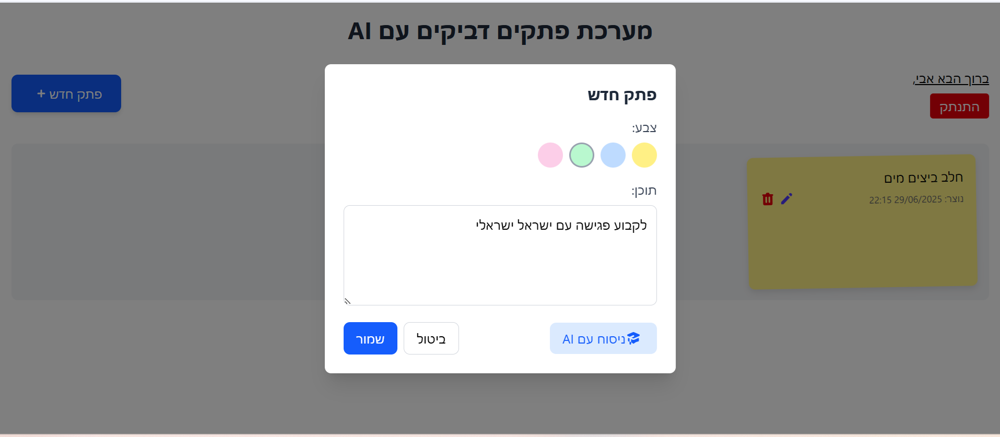

# 🗒️ Sticky Notes App with AI

A smart digital sticky notes app with AI-powered text rewriting.

---

## Stack

- **Frontend:** Angular
- **Backend:** ASP.NET Core Web API
- **Database:** MongoDB
- **Authentication:** JWT
- **AI Integration:** GEMINI API

---

## Main Features

- User registration and login with JWT-based authentication
- Each user sees only their own notes
- Full CRUD on notes (create, edit, delete)
- AI button to rephrase note content using Gemini API
- Clean and responsive UI

---

## How to Run the Project

### Prerequisites

- Node.js + Angular CLI
- .NET 7.0 / 8.0 SDK
- MongoDB (locally or MongoDB Atlas)
- Gemini API key

---

### 1. Run the Backend (.NET Core API)

- cd backend/NotesApiMongo
- dotnet restore
- dotnet run

\*\*\* notice

- you need gemini api key.
  I saved my Gemini APY Key in User Secrets in .NET environment so it wont work for you.
  you need to save your api key in User Secrets .NET environment, is the most secure way and you be able to make api call for Gemini api.
  To save your api key in User secrets run this commands:
  1. dotnet user-secrets init
  2. dotnet user-secrets set "Gemini:ApiKey" "your-api-key-here"

### 2. Run the Frontend (Angular)

- cd frontend/
- npm install
- ng serve
- npm run start

### Login Screen

### Home Page

### New Note Screen

### Using AI for Rephrasing

Users can improve or rewrite their notes using AI by clicking the "Rephrase" ("ניסוח עם AI) button. This triggers a flow where the content of the note is sent to the backend, which then communicates with an AI provider (in this case Gemini API ) to receive a rephrased version.

### User note text

### Note after AI rewrite Note

### Flow Overview

1. The user writes a note and clicks the "Rephrase" button.

2. A request is sent to the backend endpoint: POST /api/ai/rephrase.

3. The backend uses an AI service via API (API key stored securely in User Secrets).

4. The AI returns a rephrased version of the note.

5. The updated text is displayed to the user.
